# [BASE] Vite - (1) Vite 살펴보기

# Vite 셋팅하기 좋은 프로젝트

- **싱글 엔트리인 프로젝트 or 사용처 템플릿에서 빌드 파일을 Native ESM 으로 임베드 할 때**
  - Vite로 빌드할 때 multi entry이고 chunk(공통 코드) 파일이 생성될 경우 최종 빌드 파일에서 import/require로 청크 파일을 가져옴 (Vite default 타겟: Native ESM 지원 가능한 브라우저)
  - 위의 경우, 사용처 템플릿에서 빌드 파일을 Native ESM으로 임베드해야 청크 파일 등 import/require 구문을 모듈로 인지하여 정상적으로 실행할 수 있음
  - rollup은 멀티 엔트리에서 `output.inlineDynamicImports: true` 를 사용할 수 없음
    (`output.inlineDynamicImports: true` 일 때, 청크 파일로 생성하지 않고 빌드 파일에 같이 묶어서 빌드됨)
- **`@vitejs/plugin-legacy` 사용하고, 엔트리 파일이 html 일 때**
  - `@vitejs/plugin-legacy`에서 생성하는 polyfill 파일, NativeEsm 임베드 코드, Native ESM 사용할 수 없는 환경에서 `<script nomodule` 코드 자동 추가 등 필요한 리소스를 템플릿에 자동 추가해주므로 편함
- **`@vitejs/plugin-legacy` 사용하지 않아도 되는 최신 브라우저 환경 대상 서비스** - legacy() 실행 시 transpilling+polyfill 하는 속도가 느려서 esbuild로만 transpilling 하는 것이 Vite의 빠른 빌드 속도를 느낄 수 있음
</aside>

<br/> 

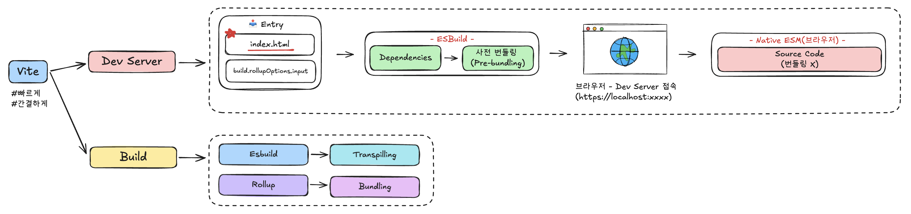

<br/> 
<br/> 

# [1] Vite란?

빠르고 간결하게 개발할 수 있도록 설계된 빌드 도구

<br/> 

### (1) 빠르다

- 기존 번들러(webpack, parcel 등)보다 빠른 개발 서버 구동 및 코드 갱신 속도 개선함

  - 개발 서버 구동을 빠르게!!
    - (의존성 파일) 사전 번들링 (esbuild)
    - (소스 코드) Native ESM 이용
  - 코드 갱신 속도를 빠르게!!
    - Native ESM 을 이용한 HMR(Hot Module Replacement)
    - 소스 코드는 `304 Not Modified`로, 디펜던시는 `Cache-Control: max-age=31536000,immutable`을 이용해 캐시하여 네트워크 요청 수를 줄임

- 빌드 최적화
  - `Rollup`을 사용하여 최적화된 프로덕션 빌드를 제공함
  - 코드 분할, 트리 쉐이킹(Tree Shaking) 등 최적화 기능이 자동 적용됨

<br/> 

### (2) 간결하다

- 간결한 기본 설정을 통해 쉽게 셋팅 가능
- 프레임워크, 타입 지원 등 플러그인을 이용해 확장 가능

<br/> 
<br/> 

# [2] Development

## (1) 개발 서버 구동 속도 개선

### 1. 의존성 파일은 사전 번들링 (Esbuild)!

개발 서버 구동 시(`vite`) **Esbuild**를 이용하여 node_modules 의존성 파일들을 사전 번들링 함

**(Q) 왜 사전 번들링을 하는가?**

- CommonJS/UMD 등 다른 타입의 모듈을 ESM 으로 트랜스파일 함
- lodash 같이 여러 모듈로 구성된 경우, 하나의 ESM 파일로 번들링하여 HTTP 요청 수를 줄임

**(Q) 사전 번들링 과정은?**

개발 서버 구동하면 Entry 확인 후 Dependencies scan 진행함

→ `node_modules` 의 dependencies만 걸러서 `node_modules/.vite/deps_temp_{해시값}` 폴더에 package.json, \_metadata.json 생성

→ 해시값 제거한 `deps` 로 폴더명 변경

→ 이후 dependencies 변경 사항이 없으면 개발 서버 구동/소스 코드 갱신 시 캐시 된 사전 번들링 파일을 호출함

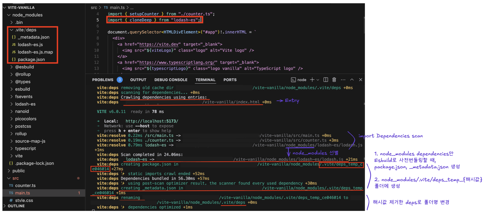

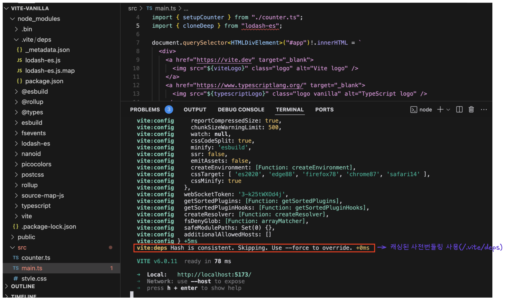

**(Q) 사전 번들링 후 캐시??**

(1) 파일 캐시 → 개발 서버 구동 속도 개선

→ 개발 서버 구동 시 의존성 파일/버전 변경 없으면 다시 번들링 하지 않고 `node_modules/.vite/deps` 에 저장된 파일을 가져옴

[https://ko.vite.dev/guide/dep-pre-bundling#file-system-cache](https://ko.vite.dev/guide/dep-pre-bundling#file-system-cache)

(2) 브라우저 캐시 → 소스 코드 갱신 속도 개선

→ 사전 번들링 된 디펜던시 파일의 HTTP 헤더에 `Cache-Control: max-age=31536000,immutable` 추가하여, 소스 코드 갱신 시 캐시된 파일들은 서버에 요청하지 않음

[https://ko.vite.dev/guide/dep-pre-bundling#browser-cache](https://ko.vite.dev/guide/dep-pre-bundling#browser-cache)

**(Q) 모노레포 디펜던시는 어떻게 처리하는가?**

- 해당 패키지 안의 `node_modules` 디펜던시는 사전 번들링을 진행하나, 동일한 레포지토리에 위치한 의존성 있는 다른 패키지는 사전 번들링은 하지 않고 의존성 분석만 한다.
  → 모노레포에서 내부 패키지들은 심볼릭 링크로 연결되어 있어서 브라우저에서 모듈로 바로 로드할 수 있기 때문
- 단, 내부 패키지들은 ESM으로 정의된 경우에만 브라우저에서 직접 로드 가능(Native ESM)
- CommonJS 등 다른 모듈 타입일 경우 아래 옵션값 설정 필요함
  - `optimizeDeps.include` : 사전 번들링 대상으로 지정
  - [\*\*`build.commonjsOptions.include`](https://ko.vite.dev/config/build-options#build-commonjsoptions) :\*\* 빌드 시 CommonJS → ESM 로 변환하여 rollup이 이해할 수 있도록 설정함(rollup은 ESM 을 사용하도록 설계되어 있음)

[https://ko.vite.dev/guide/dep-pre-bundling#monorepos-and-linked-dependencies](https://ko.vite.dev/guide/dep-pre-bundling#monorepos-and-linked-dependencies)

<br/> 
<br/> 

### 2. 소스 코드는 Native ESM!

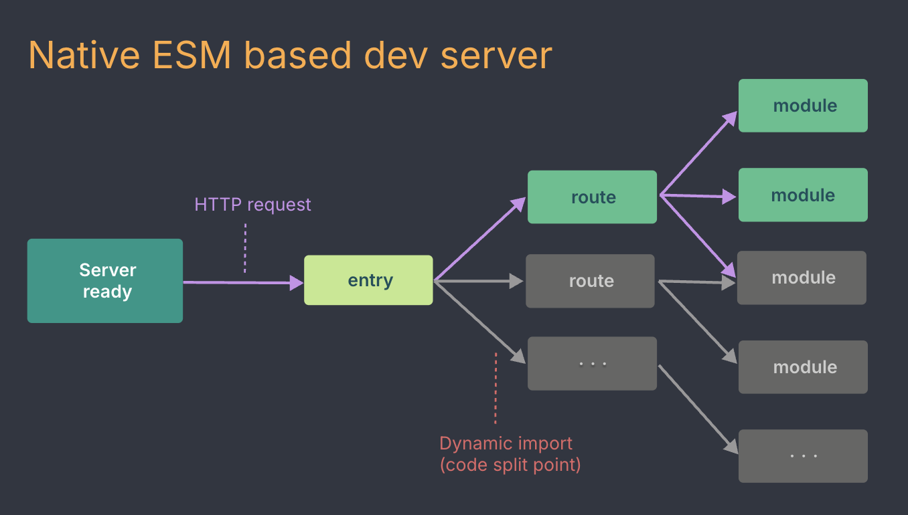

- Native ESM은 브라우저나 Node.js가 ESM 표준을 직접 지원하는 환경
- 번들러 없이 **브라우저나 Node.js에서 ESM 코드를 그대로 실행**할 수 있음
- 브라우저는 `<script type="module">`을 통해 Native ESM을 지원.
- Node.js는 `-experimental-modules` 플래그(과거) 또는 `package.json`의 `"type": "module"` 설정을 통해 지원.
- 브라우저가 ESM 파일을 개별적으로 요청하여 번들 없이 실행 가능(이로 인해 초기 요청이 많아질 수 있음).
- **사용 예시** (브라우저에서 Native ESM):
  ```html
  <!-- index.html -->
  <script type="module">
    import { add } from "./math.js";
    console.log(add(2, 3)); // 5
  </script>
  ```

<br/>
<br/> 

## (2) 소스 코드 갱신 속도 개선

### 1. HMR(Hot Module Replacement)

- Vite는 ESM을 이용하여 HMR을 구현함
- 변경된 모듈만 교체하여 브라우저에서 변경된 모듈로 전달해 줌

<aside>
💡 vite 테스트 프로젝트(`vanillaJS`) 에서 소스 코드 변경 시 (프로젝트 셋팅 시 HMR 관련 설정 커스터마이징하지 않았을 때)

- Counter.ts, main.ts(entry) 등 ts 파일 수정 시 `page reload` 발생 후 화면 갱신 됨
  - vanillaJS에서는 모듈 단위로 변경 사항을 감지할 수 없음.
    따라서 별도의 코드 없이 HMR 적용이 어려움
  - 코드 변경 시, entry 파일(`<script type=”module”>`)은 page reload 발생함
  - HMR 적용하고자 하는 모듈에 아래의 HMR API 코드 사용하여 직접 설정 가능

```
if (import.meta.hot) {
  import.meta.hot.accept((newModule) => {
    // 이전 상태 정리
    // 새로운 코드 초기화
  });
}
```

- style.css 수정 시 `hmr update` 발생 후 화면 갱신 됨
- Vite 또는 플러그인에서 HMR을 처리하지 않으면 `page reload` 를 통해 상태를 갱신한다고 함
  [https://ko.vite.dev/guide/troubleshooting.html#a-full-reload-happens-instead-of-hmr](https://ko.vite.dev/guide/troubleshooting.html#a-full-reload-happens-instead-of-hmr)

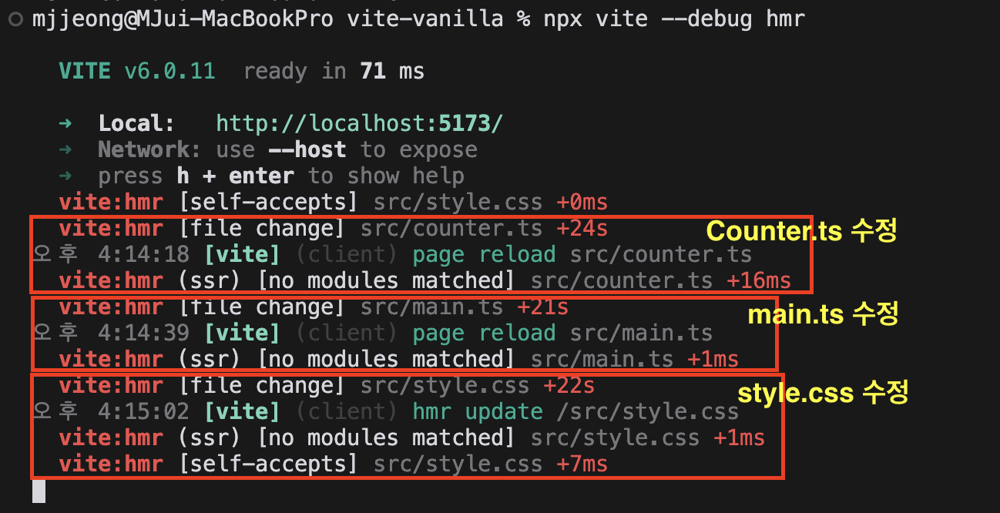

</aside>

<aside>
💡vite 테스트 프로젝트(`React`) 에서 소스 코드 변경 시 (프로젝트 셋팅 시 HMR 관련 설정 커스터마이징 하지 않았을 때)

- main.ts 수정 시 `page reload` 발생 후 화면 갱신 됨
  - React, Vue 에선 컴포넌트 별로 코드를 관리&업데이트 가능하며, 아래의 vite 플러그인에서 자동으로 HMR 적용함
    - React의 경우 👉 @vitejs/plugin-react
    - Vue의 경우 👉 @vitejs/plugin-vue
  - 코드 변경 시, entry 파일('<script type=”module”></script>')은 page reload 발생함
- App.css, App.tsx 수정 시 `hmr update` 발생 후 화면 갱신 됨

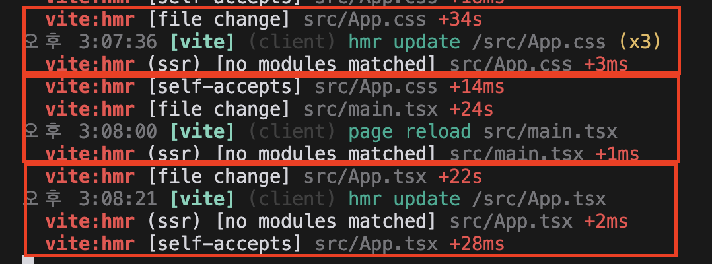

</aside>

<br/> 
<br/> 

### 2. HTTP 헤더 활용

❶ 필요한 경우 소스 코드 갱신 시, 클라이언트(브라우저) → 서버(개발서버)로 리소스 요청의 응답 헤더로 `304 Not Modified` 를 내려보낸다고 함

<aside>
💡vite 테스트 프로젝트(vanillaJS 로 셋팅)에서 소스 코드 변경 시,

- 코드 파일 요청 헤더에는 `304 Not Modified` 응답 코드 확인할 수 없었음
- 코드 파일 요청 헤더에서 `Cache-Control: no-cache` 확인할 수 있었음
→ 정확한 HMR 을 위해 개발 중일 때 서버에서 최신 파일 버전을 받을 수 있도록 함
</aside>

📒 `304 Not Modified` : 요청한 리소스를 재전송할 필요가 없다는 것을 나타내는 클라이언트 리디렉션 응답 코드. 암묵적으로 캐시된 자원으로 리디렉션하는 의미

- https://developer.mozilla.org/ko/docs/Web/HTTP/Status/304
- [304 Not Modified ](https://www.notion.so/304-Not-Modified-18814916e2a5803db6e7db31e37e73d1?pvs=21)

<br/> 
<br/> 

❷ 디펜던시는 `Cache-Control: max-age=31536000,immutable`을 이용해 캐시함

<aside>
💡vite 테스트 프로젝트(vanillaJS 로 셋팅)에서 소스 코드 변경 시,

- 의존성 파일인 `lodash-es.js` 파일 요청의 응답 헤더에서 `Cache-Control: max-age-31536000,immutable` 값 확인함

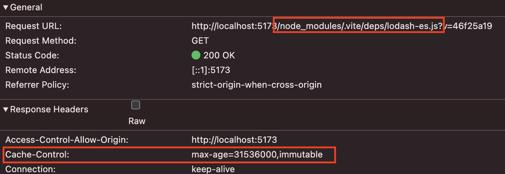

</aside>

- `Cache-Control: max-age=31536000`: 31536000(s) 시간만큼 브라우저 캐시를 적용함
  [**Cache-Control**](https://www.notion.so/Cache-Control-18814916e2a58064bd18cc7b7ee1ba7b?pvs=21)
  → 개발 시, 의존성 파일은 변경사항이 없을 것이므로 브라우저에서 장시간 캐시를 적용함
- 사전 번들링 된 디펜던시는 HTTP 헤더에 `Cache-Control: max-age=31536000,immutable` 추가하여 브라우저 캐시가 적용되도록 함


<br/> 
<br/> 

# [3] Production

## Rollup으로 번들링 하는 이유

### (1) 배포 시 번들링이 필요한 이유

- Natvie ESM으로 코드를 가져올 수 있으나, import 수만큼 네트워크 요청하게 되면 비효율적임
- treeshaking, lazy load, chunk(캐싱 목적) 등 이용하여 번들링하면 최적의 로딩 속도를 얻을 수 있음
- 개발 서버와 프로덕션 환경에 최적화된 출력(output)과 동작 일관성을 보장할 수 없음

[https://ko.vite.dev/guide/why#why-bundle-for-production](https://ko.vite.dev/guide/why#why-bundle-for-production)

### (2) Esbuild가 아닌 Rollup 을 선택한 이유 → 유연성

Esbuild(성능) 대신 Rollup의 유연한 플러그인 API 와 인프라를 선택했다고 함

[https://ko.vite.dev/guide/why#why-not-bundle-with-esbuild](https://ko.vite.dev/guide/why#why-not-bundle-with-esbuild)

단, esbuild도 빌드 과정 중 일부(트랜스파일링) 사용함!!!!!! (오직 rollup만 쓰는건 아님!!!!)
→ [`build.target`](http://build.target) 옵션 설정 시, esbuild에서 트랜스파일링 진행하므로 esbuild에서 유효한 타깃 옵션이어야 함!!

## Vite 빌드 특징

[https://ko.vite.dev/guide/build](https://ko.vite.dev/guide/build)

| 항목 | 내용 |
|------|-------|
| Scripts | `vite build` |
| Entry (default) | `{root}/index.html` |
| Format (default) | 정적 호스팅을 위한 형태 <br/> → single/multi entry로 설정해둔 index.html 도 전부 포함하여 빌드함   |
| 브라우저 지원 현황 | `Chrome >=87, Firefox >=78, Safari >=14, Edge >=88` <br/><br/> Native ESM 지원 브라우저 <br/> Native ESM 동적 import 지원 브라우저 <br/> import.meta 지원 브라우저 |
| 레거시 브라우저 지원 | [\*\*`@vitejs/plugin-legacy`](https://github.com/vitejs/vite/tree/main/packages/plugin-legacy) 플러그인 사용\*\* <br/> → 자동으로 레거시 브라우저에 대한 청크를 생성하여 브라우저가 ESM 지원하지 않는 경우에만 불러옴 |
| JS 지원 버전 | `build.target`으로 설정 가능 → 최소 `es2015` 이상이어야 함 |
| 폴리필 지원 | vite는 구문 변환만 할 뿐 폴리필은 미지원 함 → 폴리필이 필요한 경우 아래의 폴리필 이용 [https://cdnjs.cloudflare.com/polyfill/](https://cdnjs.cloudflare.com/polyfill/) |

<br/>
<br/>

# [BASE] Vite - (2) Vite 설정하기

# [1] Vite 설정 파일 생성하기

기본 설정 외 커스터 마이징이 필요한 경우 vite 옵션 설정 파일을 생성한다.

[https://ko.vite.dev/config/](https://ko.vite.dev/config/)

## (1) Vite 설정 파일 생성/실행

- `vite.config.js(ts)`로 생성하기
  Vite 스크립트 실행 시 자동적으로 루트의 `vite.config.js(ts)` 파일 확인을 시도하므로 `vite.config.js(ts)` 파일명으로 생성한다.
- CLI 옵션인 `--config` 로 지정하기
  다른 파일 명/파일 위치가 루트가 아닐 때 `vite` 스크립트 실행 시 CLI 옵션인 `--config` 를 사용하여 명시적으로 설정 파일을 지정해준다.
  (ex) `vite --config my-config.js`
- 여러 개의 설정 파일을 생성할 경우
  Vite에서 제공하는 `build()` 로 빌드하는 설정 파일들을 생성한 후 node로 해당 파일을 실행한다.
  (ex) `node vite.js-config.js`

## (2) Vite 설정 파일 코드

Vite는 Typescript 타입을 포함하고 있어 IDE 인텔리센스를 활용할 수 있음

### 1. JS로 구현 시

```jsx
// vite.config.js
export default {
  // 설정 옵션들
}

// IDE 인텔리센스 활용하고자 할 때
// 1. JSDoc 사용
/** @type {import('vite').UserConfig} */
export default {
  // ...
}

// 2. defineConfig 함수 사용
import { defineConfig } from 'vite'

export default defineConfig({
  // ...
})
```

**(Q) `defineConfig` 함수??**

`UserConfig` 타입의 옵션값(`config`)을 인자로 받고 있는 helper 함수

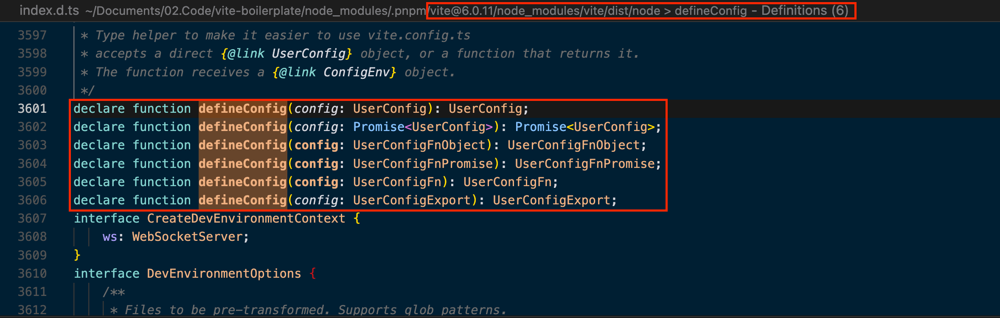

### 2. TS로 구현 시

```jsx
// vite.config.ts
import type { UserConfig } from 'vite'

export default {
  // ...
} satisfies UserConfig

// 또는 defineConfig() 함수 사용하기
import { defineConfig } from 'vite'

export default defineConfig({
  // ...
})
```

**(Q) `UserConfig` 타입?**

Vite 옵션값 타입

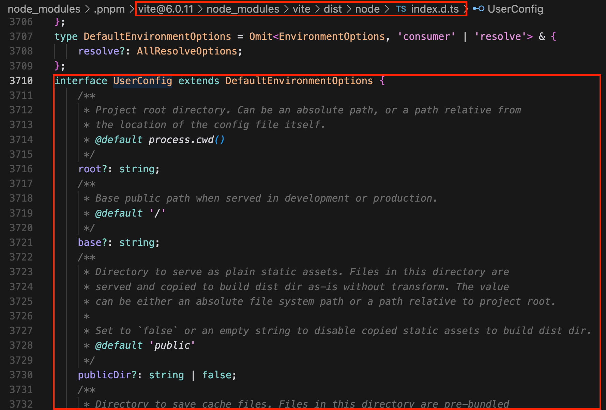

# [2] Vite 옵션 설정

## (1) 공통 설정

### 1. `root` (type: `string` , default: `process.cwd()`)

- 프로젝트 루트(index.html 이 있는 위치) 디렉토리
- 루트에 index.html 을 위치하여 추가 번들링 없이 바로 진입점(entry)으로 사용하기 위함 [https://ko.vite.dev/guide/#index-html-and-project-root](https://ko.vite.dev/guide/#index-html-and-project-root)

### 2. `base` (type: `string`, default: `/`)

- 개발/빌드 시 사용하는 Public Base Path
- JS(`import`), CSS(`url()`), `.html` 에서 참조되는 에셋 파일의 URL은 해당 값 기준으로 가져옴
- 유효한 값
  - 절대 경로(`/foo`)
  - 전체 URL([`https://bar.com/foo/`](https://bar.com/foo/) 단, URL Origin 은 사용하지 않으므로 `/foo` 와 동일함)
  - 빈 문자열 또는 `./` → 상대 경로로 생성됨
    (단,`import.meta` 사용 가능한 브라우저가 아닐 경우 `@vitejs/plugin-legacy` 플러그인을 사용해야 함)
- [https://ko.vite.dev/config/shared-options.html#base](https://ko.vite.dev/config/shared-options.html#base)
- [https://ko.vite.dev/guide/build.html#public-base-path](https://ko.vite.dev/guide/build.html#public-base-path)

### 3. `publicDir` (type: `string` | `false`, default: `public`)

- 정적 에셋을 제공하는 디렉토리
- 개발일 때는 `/` 에서 제공됨
- 빌드할 땐 outDir에 복사되는데, 변형 없이 그대로 복사됨
  `build.copyPublicDir: false` 설정 시, 복사하지 않음
- [https://ko.vite.dev/config/shared-options#publicdir](https://ko.vite.dev/config/shared-options#publicdir)

### 4. package.json에서 `browserslist` 설정하기

- vite의 플러그인 중 `autoprefixer` , `vite-plugin-browserslist`, `@vitejs/plugin-legacy`, `postcss-preset-env` 등은 package.json의 browserslist 를 우선으로 본 후, 각 플러그인 별 targets/overrideBrowserslist 과 같은 옵션 값을 본다고 함
- 한 곳에서 공통 값으로 관리할 수 있도록 package.json 에서 설정해두고, 필요한 곳에서 재설정 하는게 좋을 듯

## (2) entry 설정

| 항목 | 내용 |
| ---- | ---- |

| default

- html
  (개발 서버/빌드) | - index.html이 기본 entry (별도로 지정할 옵션 값 없음)
- multi page 일 경우 하위 index.html 도 entry 로 인지 및 개발 서버로 띄움 / 빌드 함
  ‼ Vite는 `index.html` 을 소스 코드이자 JS 모듈 그래프를 구성하는 요소로 취급함!! |
  | 빌드 옵션으로
  설정 | - `build.rollupOptions.input` 에 별도로 entry 지정 가능함 |

```jsx
build: {
    rollupOptions: {
      input: {
        main: resolve(__dirname, "index.html"),
        subKo: resolve(__dirname, "src/sub-ko/index.html"),
        subJa: resolve(__dirname, "src/sub-ja/ja.ts"),
      },
    },
  },
```

**(Q) `dist/js`, `dist/css` 폴더 분리하고 싶을 때**

(방법1) `build.rollupOptions.input`의 키 값에서 `${폴더명}/${파일명}`지정함

```jsx
build: {
	rollupOptions: {
      input: {
        "js/main": resolve(__dirname, "index.html"),
        "js/subKo": resolve(__dirname, "src/js/sub-ko/index.html"),
        "js/subJa": resolve(__dirname, "src/js/sub-ja/ja.ts"),
        "css/style": resolve(__dirname, "src/scss/style.scss"),
      },
}
```

(방법2) `build.rollupOptions.output` 옵션 지정함 (더 많이 사용!!🔥)

```jsx
output: {
        entryFileNames: "js/[name].js", // js 파일 출력 경로
        chunkFileNames: "js/chunk/[name].js", // 청크 파일 출력 경로
        assetFileNames: (assetInfo) => {
          // css 파일과 기타 에셋의 출력 경로 설정
          if (/\.(css)$/i.test(assetInfo.names[0])) {
            return "css/[name][extname]";
          }
          return `img/[name][extname]`;
        },
```

## (3) output 설정

### 1. `build.rollupOptions.output.entryFileNames`

- 진입점이 되는 js 파일명
- (Type) `string | ((chunkInfo: PreRenderedChunk) => string)`
- (Default) `"[name].js"`
- [https://rollupjs.org/configuration-options/#output-entryfilenames](https://rollupjs.org/configuration-options/#output-entryfilenames)

### 2. `build.rollupOptions.output.chunkFileNames`

- 코드 분할(code-splitting) 시 생성되는 청크 파일명
- (Type) `string | ((chunkInfo: PreRenderedChunk) => string)`
- (Default) `"[name]-[hash].js"`
- [https://rollupjs.org/configuration-options/#output-chunkfilenames](https://rollupjs.org/configuration-options/#output-chunkfilenames)

### 3. `build.rollupOptions.output.assetFileNames`

- 빌드 시 뽑아지는 커스텀 assets 파일명
- (Type) `string | ((assetInfo: PreRenderedAsset) => string)`
- (Default) `"assets/[name]-[hash][extname]"`
- [https://rollupjs.org/configuration-options/#output-assetfilenames](https://rollupjs.org/configuration-options/#output-assetfilenames)

**(Q) 파일 포맷 별로 다른 폴더로 지정하고 싶을 때**

assetFileNames를 함수로 실행하여 파일 포맷 별로 예외 처리한다.

```jsx
assetFileNames: (assetInfo) => {
  const originalFileName = assetInfo?.originalFileNames[0]; // ex. /src/img/logo/test.png
  const name = assetInfo?.names[0];
  const fileFullDir = originalFileName?.includes(name)
    ? originalFileName
    : name; // index.html에서 <link /> 연결한 css의 경우, names: [index.css], originFileNames: [index.html] 처럼 아예 다른 경우가 있었음
  const fileDir = fileFullDir?.replace(/^src\//, ""); // ex. img/logo/test.png

  // css 파일과 기타 에셋의 출력 경로 설정
  if (/\.(css)$/i.test(fileDir)) {
    return `css/${fileDir}`;
  }

  return fileDir;
},
```

assetFileNames() 함수로 사용시, 매개변수로 받는 assetInfo 타입이 아래와 같음.
assetInfo.name은 deprecated 되었다고 함

```jsx
interface PreRenderedAsset {
  names: string[];
  originalFileNames: string[];
  source: string | Uint8Array;
  type: "asset";
}
```

## (4) JS 설정

### 1. [Transpilling] [`build.target`](http://build.target) 설정하기 (esbuild)

### `build.target` (type: `string | string[]`, default: `modules`)

- 최종 번들을 위한 브라우저 호환성 타겟을 지정함(Transpilling 타겟)
- esbuild에서 transpile 지원하므로 esbuild에서 유효한 타겟명을 입력해야 함!
- 옵션값
  - (Vite 한정 옵션) `modules`(default) : `['es2020', 'edge88', 'firefox78', 'chrome87', 'safari14']`로 대체함
    → Native ESM, Native ESM의 동적 import, import.meta 지원하는 브라우저를 타깃으로 함
  - (Vite 한정 옵션) `esnext` : Native ESM의 동적 import를 제공하고 최소한의 transpile 수행함
  - esbuild에서 제공하는 유효한 타겟명
    [https://esbuild.github.io/api/#target](https://esbuild.github.io/api/#target)

**(Q) 코드에는 es6+ 이상 문법이 사용되었는데, target: “es5”로 지정하면??**

esbuild에서 빌드 에러 발생시킴!!

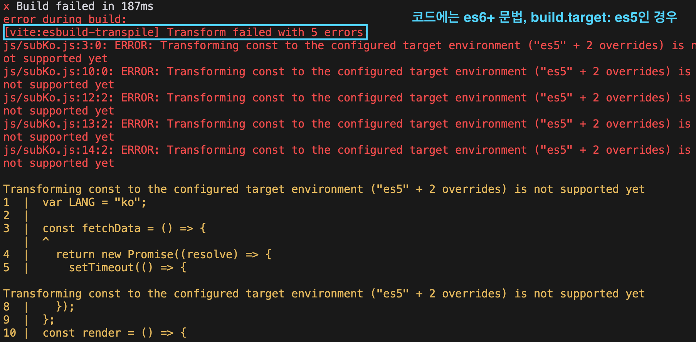

### 2. [Transpilling & Polyfill] 플러그인 이용하기

### `plugins` 에 polyfill 플러그인 `@vitejs/plugin-legacy` 추가하기

https://github.com/vitejs/vite/tree/main/packages/plugin-legacy

```jsx
plugins: [
    // polyfill 적용
    legacy({
      targets: ["chrome >= 30"], // build.target 보다 우선으로 적용됨
      renderLegacyChunks: true, // false 시 해당 target에 지원하지 않는 기능이라는 에러 발생함
    }),
  ],
```

- `renderLegacyChunks: true / false`
  - `true(default)`: 빌드 파일을 package.browserslist / legacy.targets 대상으로 트랜스파일링 한 청크 파일( `${파일명}-legacy.js` ) 생성함
  - `false` : 트랜스파일링한 청크 파일 생성하지 않음
- `renderModernChunks: true / false`
  - `true(default)`: modern 브라우저용 코드 및 lecacy 코드 같이 출력
  - `false`: legacy 코드만 출력

```jsx
// vite.config.js
import { defineConfig } from "vite";
import { resolve } from "node:path";
import { fileURLToPath } from "node:url";
import fs from "node:fs";
import legacy from "@vitejs/plugin-legacy";

const __dirname = fileURLToPath(new URL(".", import.meta.url));

export default defineConfig({
    build: {
      base: "./",
      emptyOutDir: false, // dist 폴더 비우지 않게
      outDir: "dist",
      assetsDir: "assets",
      sourcemap: true,
      assetsInlineLimit: 0, // 0으로 설정하여 모든 에셋을 파일로 저장
      rollupOptions: {
        input: {
	        "main": resolve(__dirname, `src/js/index.js`);
        },
        output: {
          format: "iife", // <script>로 임베드할 수 있도록 자체 실행 함수 형태로 빌드함
          inlineDynamicImports: true,
          entryFileNames: '[name].js',
	        chunkFileNames: 'js/chunk/[name].js',
          assetFileNames: (assetInfo) => {
            const originalFileName = assetInfo?.originalFileNames[0]; // ex. /src/img/logo/test.png
            const name = assetInfo?.names[0];
            const fileFullDir = originalFileName?.includes(name)
              ? originalFileName
              : name; // index.html에서 <link /> 연결한 css의 경우, names: [index.css], originFileNames: [index.html] 처럼 아예 다른 경우가 있었음
            const fileDir = fileFullDir?.replace(/^src\//, ""); // ex. img/logo/test.png

            // css 파일과 기타 에셋의 출력 경로 설정
            if (/\.(css)$/i.test(fileDir)) {
              return `css/${fileDir}`;
            }

            return fileDir;
          },
        },
      },
    },
    resolve: {
      alias: {
        "@js": resolve(__dirname, "src/js"),
        "@scss": resolve(__dirname, "src/scss"),
        "@img": resolve(__dirname, "src/img"),
      },
    },
    plugins: [
      legacy({
	      renderLegacyChunks: true,
        renderModernChunks: true
      }),
    ],
  });
```

## (5) CSS 설정

`sass + postcss` (전처리기 + 후처리기) 를 함께 사용하는 것을 추천함

- `sass` : 함수, 믹스인 등 확장성 있는 개발 가능 (Dart Sass 사용)
- `postcss`: autoprefixer 등 플러그인을 이용하여 최신 css 기능도 변환 및 브라우저 호환 가능

### 1. `sass` 셋팅하기

sass (Dart Sass) 설치하기

```scss
npm install -D sass
```

**(Q) Vite에서 `additionalData: ‘@use ‘@scss/base/index.scss’ as *;` 추가 시(mixin, variable 등 @forward로 설정하고) 왜 하위 모듈들은 Undefined variable 등의 에러가 발생하는가??**

→ vite의 이슈(additionalData나 중복 제거 등의 이슈?)인지, Dart sass의 이슈인지(@use자체이슈?)

- 아직 DartSass의 `@use` 구문과 모듈 시스템을 사용하기엔 불완전한 것으로 보임
- `additionalData` 에서 `@use "파일명"` 구문을 추가하면 모든 파일 최상위에 해당 코드가 추가되지만, `@use` 가 한 번만 로드되어 하위로 전파되지 않기 때문에 하위 모듈들에는 해당 코드 직접 추가해야 함
- 전역에 추가되어야 할 공통 파일들은 `@import` 구문으로 추가해야하고, 각 scss 파일에서도 `@import` 를 이용해 모듈 파일을 가져와야 함(@use 구문이 최상위여야 하므로 각 파일 상위에 구문을 추가하는 additiionData로 @import를 넣으면 하위의 @use 구문이 있는 파일에서 빌드 에러 발생함)

**(Q) Webpack과 vite의 scss 처리하는 과정의 차이점은??**

- webpack은 번들로 묶어서 처리 - vite는 각 개별 파일을 병렬적으로 처리
- additionalData는 webpack에선 entry에만 추가, vite에선 각 개별 파일별 추가함

### 2. `postcss` 셋팅하기

- vite에는 postcss가 내장되어 있어 기본적인 기능을 사용할 땐 별도로 postcss 설치하지 않아도 됨
  (ex) autoprefixer 패키지 설치 및 실행 시에는 postcss 미설치로도 동작함
- tailwinds 사용 등 복잡한 기능 사용 시에는 postcss 설치해서 사용해야 함
- 별도의 `postcss.config.js` 있을 경우 해당 파일을 본다고 함
  [https://ko.vite.dev/guide/features.html#postcss](https://ko.vite.dev/guide/features.html#postcss)

```jsx
import { defineConfig } from "vite";
import { resolve } from "path";
import fs from "fs";
import autoprefixer from "autoprefixer";

// ... existing code ...

export default defineConfig({
  root: ".",
  build: {
    rollupOptions: {
      input: getModuleList(),
      output: {
        entryFileNames: "[name].js",
        chunkFileNames: "js/chunk/[name].js",
        assetFileNames: (assetInfo) => {
          const originalFileName = assetInfo?.originalFileNames[0]; // ex. /src/img/logo/test.png
          const name = assetInfo?.names[0];
          const fileFullDir = originalFileName?.includes(name)
            ? originalFileName
            : name; // index.html에서 <link /> 연결한 css의 경우, names: [index.css], originFileNames: [index.html] 처럼 아예 다른 경우가 있었음
          const fileDir = fileFullDir?.replace(/^src\//, ""); // ex. img/logo/test.png

          // css 파일과 기타 에셋의 출력 경로 설정
          if (/\.(css)$/i.test(fileDir)) {
            return `css/${fileDir}`;
          }

          return fileDir;
        },
      },
    },
  },
  css: {
    preprocessorOptions: {
      scss: {
        // 모든 SCSS 파일에서 공통으로 사용할 파일들
        additionalData: `
          @import "src/scss/common" as *;
        `,
        // SCSS 모듈을 찾을 경로 설정
        includePaths: [resolve(__dirname, "_src/scss")],
      },
    },
    // postcss 설정
    postcss: {
      plugins: [
        autoprefixer(), // overrideBrowserslist 옵션으로 타겟 브라우저 오버라이딩 가능
      ],
    },
  },
});
```

## (6) Image, SVG 설정

```jsx
// vite.config.ts
	base: "./",
  build: {
    outDir: "dist",
    assetsDir: "assets",
    assetsInlineLimit: 0, // 0으로 설정하여 모든 에셋을 파일로 저장
    ..
    output: {
        entryFileNames: "js/[name].js", // js 파일 출력 경로
        chunkFileNames: "js/chunk/[name].js", // 청크 파일 출력 경로
        assetFileNames: (assetInfo) => {
          const originalFileName = assetInfo?.originalFileNames[0]; // ex. /src/img/logo/test.png
          const name = assetInfo?.names[0];
          const fileFullDir = originalFileName?.includes(name)
            ? originalFileName
            : name; // index.html에서 <link /> 연결한 css의 경우, names: [index.css], originFileNames: [index.html] 처럼 아예 다른 경우가 있었음
          const fileDir = fileFullDir?.replace(/^src\//, ""); // ex. img/logo/test.png

          // css 파일과 기타 에셋의 출력 경로 설정
          if (/\.(css)$/i.test(fileDir)) {
            return `css/${fileDir}`;
          }

          return fileDir;
        },
      },
  ...

  resolve: {
    alias: {
	    ...
      "@img": resolve(__dirname, "src/img"),
      "@svg": resolve(__dirname, "src/svg"),
      "@public": resolve(__dirname, "src/public")
      ...
    },

```

### 1. JS - `import` / `new URL(imgPath, import.meta.url)`, CSS - `url()` 로 이미지를 import해야 출력 파일 생성됨!!

- 단순 string imgPath 만 입력 시, public img 를 사용하는 것으로 인지하여 빌드 시에도 해당 경로가 그대로 유지됨
- `import.meta.url` : 네이티브 ESM API 중 하나로, 현재 모듈의 URL을 보여주는 기능
  [https://developer.mozilla.org/en-US/docs/Web/JavaScript/Reference/Operators/import.meta](https://developer.mozilla.org/en-US/docs/Web/JavaScript/Reference/Operators/import.meta)
  (ex) 위 예제의 `import.meta.url` 값은 [`http://localhost:5174/src/js/main.ts?t=1739113928165`](http://localhost:5174/src/js/main.ts?t=1739113928165) 임
- `new URL(filePath, 기준 URL 문자열)` : 주어진 절대 URL, 또는 상대 URL과 기준 URL 문자열을 사용해 생성한 `URL` 객체를 생성하고 반환함
  [https://developer.mozilla.org/ko/docs/Web/API/URL](https://developer.mozilla.org/ko/docs/Web/API/URL)

### 2. `base: "/"` `base: "./"` base 의 절대/상대 경로 설정에 따라 달라지는 부분

**🌈 `/src/img`, `/src/svg` 폴더인 경우**

| import방법 | `base: "/"`
`base: “./”`
Devserver | `base: "/"`
Build | `base: "./"`
Build |
| --- | --- | --- | --- |
| (1) import 절대경로 | `/src/img/~.png` | `/img/logo/~.png` | `new URL("../img/logo/~.png",
import.meta.url).href` |
| (2) import 상대경로 | `/src/svg/~.svg` | `/svg/~.svg` | `new URL("../svg/~.svg",
import.meta.url).href` |
| (3) new URL(imgPath, import.meta.url) | `http://localhost:5174/src/svg/~.svg` | `new URL("/svg/~.svg",
import.meta.url)` | `new URL("" + new URL("../svg/~.svg",
import.meta.url).href,
import.meta.url)` |
| (4) imgPath
단순 문자열 | `/src/img/~.png` | `/src/img/~.png` | `/src/img/~.png` |
| (5) css - url() | `url(/src/img/usagi3-src-img.gif)` | `/img/~.gif` | `url(../img/~.gif)` |

- **`base: "/"` , `base: "./"` Devserver** 는 둘 다 동일한 경로로 에셋을 호출하였음
  → (3) new URL() 제외하곤 절대 경로로 호출함
- **`base: "/"` Build**도 imgPath 부분이 절대 경로로 변환되었음
  → public path가 root 경로일 때는 사용해도 되겠지만, public path에 subpath 가 있는 경우엔 적합하지 않음
- `base: "./"` Build는 `new URL(상대경로, import.meta.url)` 로 변환되었음
  ((3) 의 경우, imgPath가 이미 new URL()인 상태이므로, new URL()이 두번 사용됨))
  → `import.meta.url` 현재 모듈 위치 기준으로 url 정의되므로 public path가 root 경로가 아닐 경우 사용하기 적합함

### 3. build 시 `assetsInlineLimit: 0` 로 설정해야 모든 이미지가 파일로 빌드됨

[https://ko.vite.dev/config/build-options.html#build-assetsinlinelimit](https://ko.vite.dev/config/build-options.html#build-assetsinlinelimit)

- (default) 4KB
- 이 값보다 작은 크기로 import 되거나 참조된 에셋은 부가적인 http 요청을 피하고자 base64 URL로 인라인 처리됨
  → 따라서, `0` 으로 설정해야 모든 이미지가 파일로 빌드됨

# [3] Vite 설정 시 발생한 이슈들

### ⚠️`build.rollupOptions.input` 에 멀티 엔트리로 지정 시, 빌드 파일에 chunk 파일을 import 하는 구문 그대로 살아 있음

```jsx
import { g as d } from "../chunk/index.js";
import { g as p, A as o, C as m } from "../chunk/conti.js";
```

- 여러 엔트리에서 공통으로 사용하는 ‘/repository/index.js’, ‘/config/common.js’ 두 파일이 청크로 생성됨
- Vite의 최소 빌드 타겟은 Native ESM을 제공하는 브라우저 대상이므로 import 구문으로 ESM 모듈을 가져옴
- import 는 비동기적으로 모듈을 로드하여 `load` 발생 전까지는 모든 모듈이 로드 되나, `DomContentLoaded` 전까지는 로드가 완료되지 않을 수 있음
- 사용처(html)에서 해당 빌드 파일을 `<script type="module">`로 임베드해야 브라우저에서 ESM으로 인지 후 import 로 연결한 모듈 파일을 로드할 수 있으나, `<script src="" />` 로 임베드할 경우 ESM으로 인지하지 못해 에러 발생함
- 사용처(html)에서 `load` 이벤트 콜백에서 해당 빌드 파일 로드 후 실행 구문 호출해야 정상적으로 실행됨

**(Q) webpack에선 import 모듈 구문을 어떻게 처리하는가??**

webpack에서 babel-loader(core-js, @babel-loader/preset/env)로 js 파일을 transpilling & polyfill 처리할 때

1. ESM의 `import/export` → CommonJS의 `require/exports`
2. 모든 모듈을 번들링하여 하나의 IIFE(즉시 실행 함수)로 감쌈
3. 각 모듈에 고유 ID 부여
4. 모듈 캐싱을 통한 싱글톤 패턴 구현

```jsx
// 원본 코드 (ESM)
import { something } from "./module";

// 변환 후 (CommonJS)
// webpack이 생성하는 모듈 시스템
(function (modules) {
  // 웹팩의 모듈 로더 로직
  function __webpack_require__(moduleId) {
    // ... 모듈 캐싱 및 실행 로직
  }

  // 모듈 0번을 실행 (엔트리 포인트)
  return __webpack_require__(0);
})({
  // 모듈 0: 메인 파일
  0: function (module, exports, __webpack_require__) {
    "use strict";
    // import 구문이 require로 변환됨
    var _module = __webpack_require__(1);
  },

  // 모듈 1: 임포트된 모듈
  1: function (module, exports) {
    "use strict";
    exports.something = function () {
      /* ... */
    };
  },
});
```

(babel 역할) 최신 JS 문법을 변환

(webpack 역할) 모듈 번들링 및 실행 환경 구성

### ⚠️\*\*`build.rollupOptions.input` 에 멀티 엔트리로 지정 시, `ouput.inlineDynamicImports: true` 지정이 안 됨!!!

(동적 import 구문을 내부 코드로 처리하는 옵션)\*\*

⇒ `Rollup` 이슈임!!

`output.inlineDynamicImports: true` 로 지정 시, import 구문으로 청크파일을 호출하지 않고 소스 코드 내에 포함되어 빌드됨
단, 싱글 엔트리에서만 설정이 가능한 상황!!! (Rollup에서 멀티 엔트리일 때 지원하지 않는 기능임)

```jsx
x Build failed in 596ms
error during build:
Invalid value for option "output.inlineDynamicImports" - multiple inputs are not supported when "output.inlineDynamicImports" is true.
    at getRollupError (/node_modules/rollup/dist/es/shared/parseAst.js:396:41)
    at error (/node_modules/rollup/dist/es/shared/parseAst.js:392:42)
    at getInlineDynamicImports (/node_modules/rollup/dist/es/shared/node-entry.js:21637:16)
    at normalizeOutputOptions (/node_modules/rollup/dist/es/shared/node-entry.js:21526:34)
    at getOutputOptions (/node_modules/rollup/dist/es/shared/node-entry.js:21930:12)
    at getOutputOptionsAndPluginDriver (/node_modules/rollup/dist/es/shared/node-entry.js:21925:19)
    at async handleGenerateWrite (/node_modules/rollup/dist/es/shared/node-entry.js:21901:74)
    at async buildEnvironment (/node_modules/vite/dist/node/chunks/dep-M1IYMR16.js:51082:16)
    at async Object.defaultBuildApp [as buildApp] (/node_modules/vite/dist/node/chunks/dep-M1IYMR16.js:51513:5)
    at async CAC.<anonymous> (/node_modules/vite/dist/node/cli.js:853:7)
```

**(해결방법1) `inlineDynamicImports: true` 사용하기 위해 js를 싱글 엔트리로 여러 번 빌드하기 (vite에서 제공하는 `build()` 여러 번 실행)**

→ nodejs 코드로 js 엔트리 수만큼 `vite build`를 진행한다.

[https://github.com/rollup/rollup/issues/5601#issuecomment-2474350383](https://github.com/rollup/rollup/issues/5601#issuecomment-2474350383)

```jsx
// vite.js-build.js
import { defineConfig, build as viteBuild } from "vite";
import { resolve } from "node:path";
import { fileURLToPath } from "node:url";
import fs from "node:fs";
import legacy from "@vitejs/plugin-legacy";

const __dirname = fileURLToPath(new URL(".", import.meta.url));

const getJsModuleData = () => {
  const jsPath = resolve(__dirname, "src/js");
  let data = {};
  try {
    // src/js내 1뎁스 폴더명 추출
    fs.readdirSync(jsPath)
      .filter((file) => fs.statSync(resolve(jsPath, file)).isDirectory())
      .map((folder) => {
        data[`js/art/${folder}`] = resolve(
            __dirname,
            `src/js/${folder}/app.js`
          );
      });
  } catch (e) {
    console.error("=== src/js 내 폴더를 찾을 수 없습니다. ===", e);
  }

  return data;
};

const build = async (entry, filesrc) => {
  console.log(entry, filesrc);

  const config = defineConfig({
    build: {
	    ...
      rollupOptions: {
        input: filesrc,
        output: {
          format: "iife", // <script>로 임베드할 수 있도록 자체 실행 함수 형태로 빌드함
          inlineDynamicImports: true,
          ...
        }
      }
    }
  });

  try {
    await viteBuild(config);
    console.log(`Successfully built ${entry}`);
  } catch (e) {
    console.error(`Error building ${entry}:`, e);
  }
};

const jsBuild = async () => {
  console.time("jsBuild-parrallel");
  const target = Object.entries(getJsModuleData());

  // 순차적 빌드
  //   for (const [entry, filesrc] of target) {
  //     await build(entry, filesrc);
  //   }

  // 또는 병렬로 빌드
  await Promise.all(target.map(([entry, filesrc]) => build(entry, filesrc)));
  console.timeEnd("jsBuild-parrallel");
};

jsBuild()
  .then(() => {
    console.log("All builds completed");
  })
  .catch((err) => {
    console.error(`Build failed: `, err);
    process.exit(1);
  });

```

```jsx
// package.json
"scripts": {
	"build": "node vite.js-build.js"
}
```

(해결방법2) 공유 chunk가 생기지 않도록 공통 파일 import 구문에 임의의 매개변수를 추가함

→ 기능에 아무런 영향을 미치지 않지만 두 개의 가져오기가 동일하지 않음을 나타냄

[https://github.com/rollup/rollup/issues/5601#issuecomment-2324796908](https://github.com/rollup/rollup/issues/5601#issuecomment-2324796908)

```jsx
import "shared?a";
import "shared?b";
```

<br/>
<br/>

# [BASE] Vite - (3) Plugin & @vitejs/plugin-legacy

# [1] Vite Plugin

- Rollup Plugin 인터페이스에서 Vite 특정 옵션을 추가한 형태로 구성됨
- (Rollup plugin) [https://rollupjs.org/plugin-development/](https://rollupjs.org/plugin-development/)
- (Vite plugin) [https://ko.vitejs.dev/guide/api-plugin.html#plugins-config](https://ko.vitejs.dev/guide/api-plugin.html#plugins-config)

## (1) Rollup Plugin

- 플러그인은 properties, build hooks, output generation hooks 중 하나 이상으로 구성된 객체

```jsx
// 예제 - virtual-module 상태 감지해서 처리하는 로직
export default function myExample() {
  return {
    name: "my-example", // this name will show up in logs and errors
    resolveId(source) {
      if (source === "virtual-module") {
        // this signals that Rollup should not ask other plugins or check
        // the file system to find this id
        return source;
      }
      return null; // other ids should be handled as usually
    },
    load(id) {
      if (id === "virtual-module") {
        // the source code for "virtual-module"
        return 'export default "This is virtual!"';
      }
      return null; // other ids should be handled as usually
    },
  };
}
```

### **1. properties**

- name
- version

### **2. Build hooks**

- 빌드 단계에서 hooks를 통해 빌드 실행에 영향을 주거나, 빌드 정보를 가져오거나, 빌드 결과물을 수정하는 등 작업이 가능함
- 기본적으로 함수이며(async, first, sequential, parallel 타입), 더 많은 옵션 추가를 위해 객체로 구현 시 handler 함수를 구현해야 함
- 함수일 때: `async`, `first`, `sequential`, `parallel` 타입
  - `async` : 빌드 훅은 동기이나, Promise를 반환하여 비동기로 설정 가능(같은 타입의 값을 resolve해야 함)
  - `first` : 여러 플러그인에 빌드 훅이 있으면, null/undefined가 아닌 값을 반환할 때까지 순차적으로 실행됨
  - `sequential` : 여러 플러그인에 빌드 훅이 있으면, 사용자가 지정한 순서대로 실행되는데 현재 훅이 비동기일 때 resolve 될 때까지 기다린 후 다음 플러그인의 훅이 실행됨
  - `parallel`: 여러 플러그인에 빌드 훅이 있으면, 사용자가 지정한 순서대로 실행되는데 현재 훅이 비동기일 때 resolve 될 때까지 기다리지 않고 다음 훅은 병렬로 실행됨
- 객체일 때:

  - `order`: 여러 플러그인에서 Build hook 구현 시, 실행 순서를 직접 정의할 수 있음
    - “pre”: 가장 먼저
    - “post”: 맨 마지막
    - no value / null: 사용자가 지정한 위치

  ```jsx
  export default function resolveFirst() {
    return {
      name: "resolve-first",
      resolveId: {
        order: "pre",
        handler(source) {
          if (source === "external") {
            return { id: source, external: true };
          }
          return null;
        },
      },
    };
  }
  ```

  - `sequential: boolean`
    `parallel` 훅일 때 사용하며, 병렬로 실행하지 않도록 설정하는 옵션
    (ex) A, B, C, D, E 플러그인 중 C의 sequential: true일 때,
    A + B 병렬 실행 → C 혼자 실행 → D + E 병렬 실행됨

  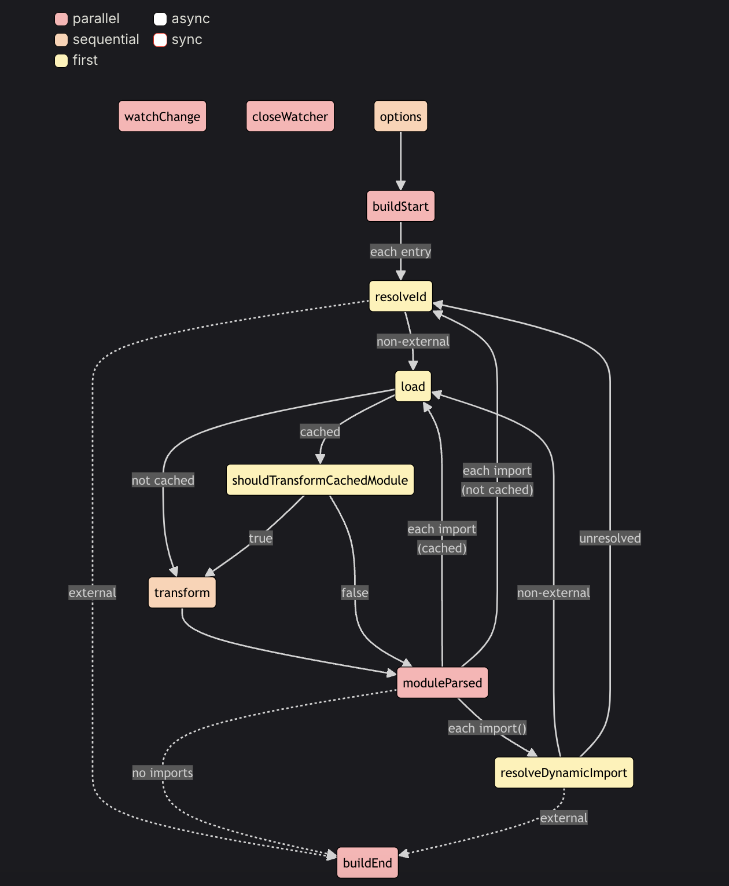

- 빌드 훅은 `rollup.rollup(inputOptions)` 에 트리거되어 발생하는 빌드 단계에서 실행됨
  ※ `rollup.rollup(inputOptions)`
  [https://rollupjs.org/javascript-api/#rollup-rollup](https://rollupjs.org/javascript-api/#rollup-rollup)
  - inputOptions를 매개변수로 받아서 번들 파일들을 resolve하는 Promise 객체를 반환함
  - 해당 함수 실행 시 빌드 단계가 진행되는데, 모듈 그래프가 구축되고 트리쉐이킹 되지만 실제 output 출력 파일을 생성하는 것은 아님!!!

```jsx
import { rollup } from 'rollup';

// see below for details on these options
const inputOptions = {
	/* ... */
};

build();

async function build() {
	let bundle;
	let buildFailed = false;
	try {
		// Create a bundle. If you are using TypeScript or a runtime that
		// supports it, you can write
		//
		// await using bundle = await rollup(inputOptions);
		//
		// instead and do not need to close the bundle explicitly below.
		bundle = await rollup(inputOptions);

		// an array of file names this bundle depends on
		console.log(bundle.watchFiles);

		await generateOutputs(bundle);
	} catch (error) {
```

- 빌드 훅 시작은 `options`, 마지막은 `buildEnd` 이며, 빌드 에러 발생 시 `closeBundle` 호출됨
- 주요 Hook 예시

| Hook         | 설명                            | 호출 시점                                 |
| ------------ | ------------------------------- | ----------------------------------------- |
| `buildStart` | 빌드가 시작될 때 실행           | `rollup.rollup()` 시작 시                 |
| `resolveId`  | 모듈을 찾을 때 실행             | import를 분석할 때                        |
| `load`       | 특정 모듈을 읽어올 때 실행      | 모듈을 로드할 때                          |
| `transform`  | 각 모듈의 코드를 변환할 때 실행 | 코드 변환 시 (예: Babel, TypeScript 변환) |
| `buildEnd`   | 빌드가 끝날 때 실행             | 에러 발생 여부와 관계없이 마지막에 실행   |

```jsx
export default {
  input: "src/index.js",
  plugins: [
    {
      name: "example-plugin",
      buildStart() {
        console.log("🔨 빌드가 시작됩니다!");
      },
      transform(code, id) {
        console.log(`📄 ${id} 파일을 변환 중...`);
        return code;
      },
      buildEnd() {
        console.log("✅ 빌드가 끝났습니다.");
      },
    },
  ],
};
```

### **3. Ouput Generation Hooks**

- 번들 생성 후 생성된 번들에 대한 정보를 제공하거나 빌드 결과물을 수정할 수 있는 훅
- 빌드 훅과 같은 방법, 타입으로 실행되나, `bundle.generate(outputOptions)`, `bundle.write(outputOptions)` 실행 시 호출됨
  → 하나의 번들에 대해 여러 개의 출력 형식이 존재하면 **출력할 때마다 실행**됨 - `bundle.generate()` 최종 번들 파일을 메모리 상에 생성하는 함수 - `bundle.write()` 최종 번들 파일을 disk에 직접 생성하는 함수
- 주요 Hook 예시

| Hook             | 설명                                   | 호출 시점                                         |
| ---------------- | -------------------------------------- | ------------------------------------------------- |
| `renderStart`    | 출력이 시작될 때 실행                  | `bundle.generate()` 또는 `bundle.write()` 시작 시 |
| `generateBundle` | 최종 번들이 생성된 후 실행 (수정 가능) | 번들 파일이 만들어진 후                           |
| `writeBundle`    | 번들 파일이 디스크에 저장된 후 실행    | `bundle.write()` 완료 후                          |

```jsx
export default {
  input: "src/index.js",
  output: [
    { file: "dist/bundle.cjs.js", format: "cjs" },
    { file: "dist/bundle.esm.js", format: "esm" },
  ],
  plugins: [
    {
      name: "output-plugin",
      generateBundle(options, bundle) {
        console.log(`📦 번들이 생성되었습니다! 출력 형식: ${options.format}`);
        for (const fileName in bundle) {
          console.log(`📝 생성된 파일: ${fileName}`);
        }
      },
      writeBundle() {
        console.log("✅ 번들이 파일로 저장되었습니다.");
      },
    },
  ],
};
```

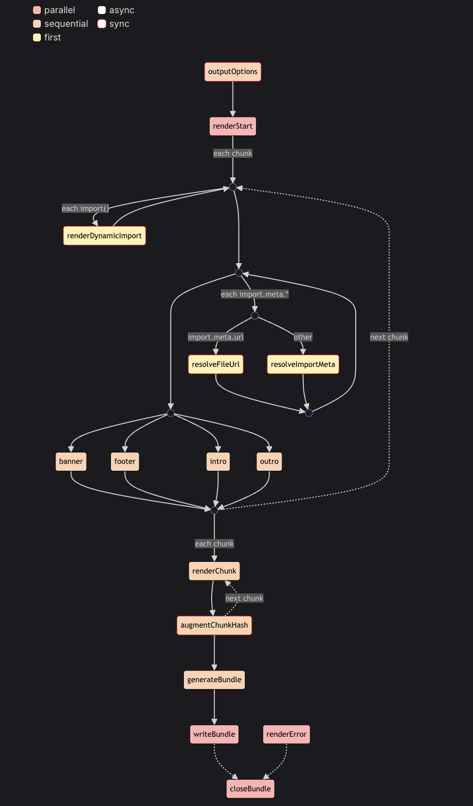

### **4. Build Hook과 Output Generation Hook의 차이점**

| Hook 종류                  | 실행 시점                                                               | 주요 역할                                          | 호출 방식                            |
| -------------------------- | ----------------------------------------------------------------------- | -------------------------------------------------- | ------------------------------------ |
| **Build Hook**             | `rollup.rollup(inputOptions)` 실행 시                                   | 빌드 프로세스 동안 실행 (예: 코드 변환, 번들 생성) | 한 번 실행됨                         |
| **Output Generation Hook** | `bundle.generate(outputOptions)`, `bundle.write(outputOptions)` 실행 시 | 번들 출력 과정에서 실행 (예: 번들 수정, 정보 제공) | 출력 형식(output)마다 여러 번 실행됨 |

➡️ **핵심 차이점:**

- `Build Hook` 은 **번들을 생성하는 과정**에서 실행
- `Output Generation Hook` 은 **번들을 출력하는 과정**에서 실행
- `Output Generation Hook` 은 **출력 옵션(outputOptions)에 따라 여러 번 실행**될 수 있음(반면, `Build Hook` 은 빌드 과정에서 한 번 실행됨)

## (2) Vite Plugin

### 1. Vite 플러그인 설정

- Vite 옵션 중 플러그인을 설정하는 `plugins: PluginOption[] | undefined` 타입임
- 플러그인은 여러 플러그인을 배열로 반환하도록 구현 가능함
  → `@vitejs/plugin-legacy` 도 세 플러그인 함수를 배열로 묶어서 반환함
- plugins 에 정의한 배열들은 자동으로 병합됨

```jsx
// vite.config.js
import vitePlugin from 'vite-plugin-feature'
import rollupPlugin from 'rollup-plugin-feature'

export default defineConfig({
  plugins: [vitePlugin(), rollupPlugin()]
})

// 플러그인을 여러 플러그인 배열로 구성하여 실
// framework-plugin 플러그인 코드
import frameworkRefresh from 'vite-plugin-framework-refresh'
import frameworkDevtools from 'vite-plugin-framework-devtools'

export default function framework(config) {
  return [frameworkRefresh(config), frameworkDevTools(config)]
}

// vite.config.js
import { defineConfig } from 'vite'
import framework from 'vite-plugin-framework'

export default defineConfig({
  plugins: [framework()]
})
```

### 2. Vite 개발 서버 실행 시

- Rollup의 빌드 훅(Build Hooks) 를 호출하는 컨테이너를 생성함
- 서버 시작 시 호출하는 빌드
  - [**`options`**](https://rollupjs.org/plugin-development/#options)
  - [**`buildStart`**](https://rollupjs.org/plugin-development/#buildstart)
- 모듈을 요청할 때(import)마다 호출하는 빌드 훅
  - [**`resolveId`**](https://rollupjs.org/plugin-development/#resolveid)
  - [**`load`**](https://rollupjs.org/plugin-development/#load)
  - [**`transform`**](https://rollupjs.org/plugin-development/#transform)
- 서버가 종료될 때 호출하는 빌드 훅

  - [**`buildEnd`**](https://rollupjs.org/plugin-development/#buildend)
  - [\*\*`closeBundle`](https://rollupjs.org/plugin-development/#closebundle) (Output Generation Hooks 중에 closeBundle 훅만 호출함)\*\*

- Vite는 더 효율적인 동작을 위해 전체 소스에 대한 AST 구문 분석을 진행하지 않기에, moduleParsed 훅은 개발 과정에서 호출되지 않음
- 개발 서버에선 Output Generation Hooks 중에는 `closeBundle` 훅만 호출하며, `bundle.generate()` 을 호출하지 않고 `rollup.rollup()`만 호출한다고 생각하면 됨
  (개발 서버에서는 최종 번들 파일을 생성하지 않으므로, `bundle.generate()`는 호출하지 않는 듯)

### 3. Vite 전용 훅

- `config` : Vite 설정 값을 사용 전 수정할 수 있는 훅(deep merge)

```jsx
// 설정 값 일부를 반환 (권고)
const partialConfigPlugin = () => ({
  name: "return-partial",
  config: () => ({
    resolve: {
      alias: {
        foo: "bar",
      },
    },
  }),
});

// 전달받은 설정 객체를 직접 수정 (위 방법으로 불가능할 때 사용)
const mutateConfigPlugin = () => ({
  name: "mutate-config",
  config(config, { command }) {
    if (command === "build") {
      config.root = "foo";
    }
  },
});
```

- `configResolved` : Vite 설정 값이 확정된 후 호출되는 훅

```jsx
const examplePlugin = () => {
  let config;

  return {
    name: "read-config",

    configResolved(resolvedConfig) {
      // 확정된 설정 값을 저장
      config = resolvedConfig;
    },

    // 다른 훅에서 저장된 설정 값을 이용
    transform(code, id) {
      if (config.command === "serve") {
        // dev: 개발 서버에서의 플러그인 행동 정의
      } else {
        // build: Rollup 시 플러그인 행동 정의
      }
    },
  };
};
```

- `configureServer` : 개발 서버를 구성하기 위한 훅
  - 내부 미들웨어가 설치되기 전에 훅이 호출되며 주로 미들웨어를 연결할 때 사용함
  - 내부 미들웨어 설치 후에 실행할 코드들은 훅에 함수 반환하면 됨
  - 또는, 서버 인스턴스를 사용해야 할 때 호출함(웹 소켓 서버, 모듈 의존성 그래프 등 접근할 때)

```jsx
const myPlugin = () => ({
  name: 'configure-server',

  // 미들웨어 연결 시
  configureServer(server) {
    server.middlewares.use((req, res, next) => {
      // 이 곳에서 원하는 방식으로 요청을 핸들링 할 수 있습니다
    })
  }

  // 미들웨어 연결 시 (내부 미들웨어 설치된 후에 호출할 때)
  configureServer(server) {
    // 내부 미들웨어가 설치된 후
    // 실행될 훅을 반환합니다
    return () => {
      server.middlewares.use((req, res, next) => {
        // 이 곳에서 원하는 방식으로 요청을 핸들링 할 수 있습니다
      })
    }
  },

  // 서버 인스턴스 받아서 처리할
  configureServer(_server) {
      server = _server
    },
    transform(code, id) {
      if (server) {
        // 서버 인스턴스 사용...
      }
    }
})
```

- `configurePreviewServer` : 프리뷰 서버 구성할 때 사용함. `configureServer` 와 비슷
- `transformIndexHtml`
  - index.html과 같은 html 엔트리를 변환할 때 호출하는 훅
  - `order: undefined`일 때(default) html 변환된 후 훅이 호출되나,
    `order: ‘pre’` 이면 HTML을 변환하기 전 훅이 호출되고,
    `order: ‘post’` 이면 order를 정하지 않은 훅들이 모두 호출된 후 훅을 적용함

```jsx
const htmlPlugin = () => {
  return {
    name: "html-transform",
    transformIndexHtml(html) {
      return html.replace(
        /<title>(.*?)<\/title>/,
        `<title>Title replaced!</title>`
      );
    },
  };
};
```

- `handleHotUpdate` : HMR 동작할 때 호출하는 훅

### 4. 플러그인 순서

- webpack 로더처럼 `enforce: 'pre', 'post'` 프로퍼티 추가하여 플러그인 순서를 제어함
  - 별칭
  - `enforce: 'pre'`로 지정된 플러그인
  - Vite 코어 플러그인
  - enforce 값이 존재하지 않는 플러그인
  - Vite 빌드 플러그인
  - `enforce: 'post'`로 지정된 플러그인
  - 빌드 후 실행되는 Vite의 플러그인 (minify, manifest, reporting)
- `order` 순서 시정 시 order 순서로 실행됨

### 5. 플러그인 사용 조건

- 플러그인은 개발 / 빌드 시 전부 호출됨
- `apply: 'serve', 'build'` 개발/빌드 시에만 실행되도록 하는 프로퍼티
  (함수로도 제어 가능)

```jsx
function myPlugin() {
  return {
    name: 'build-only',
    apply: 'build' // 또는 'serve'

    // 함수로도 제어 가능
    apply(config, { command }) {
		  // 빌드 시 적용되지만 SSR에는 적용되지 않는 플러그인
		  return command === 'build' && !config.build.ssr
		}
  }
}
```

# [2] `@vitejs/plugin-legacy`

## (1) `@vitejs/plugin-legacy`란?

- `@vitejs/plugin-legacy`는 프로덕션 빌드 시, Native ESM, Native ESM 동적 import, import.meta를 지원하지 않는 레거시 브라우저에서도 동작할 수 있도록 제공해주는 플러그인
- vite 패키지(vite/packages/plugin-legacy)에 포함되어 있으며, 에반유가 직접 구현한 플러그인
- 최종 번들의 모든 청크 파일에 대한 레거시 청크 파일을 생성함
- **modern chunks의 transpilling → `esbuild` 사용함
  legacy chunks의 transpilling → `@babel/preset-env` 사용함**
- `import.meta.env.LEGACY` 환경 변수를 삽입하는데, 레거시 프로덕션 빌드일 때만 true 이고 나머진 false 임
- 생성된 HTML에 폴리필과 레거시 청크 파일을 `<script nomodule>` 구문으로 임베드하도록 추가하여 레거시 브라우저에서 이를 로드할 수 있도록 함

※ legacy chunk는 `@babel/preset-env`로 트랜스파일 후 SystemJS 모듈로 내보냄

<aside>
💡

SystemJS란?

- JS 모듈 로더로, 런타임에서 동적으로 모듈을 로드할 수 있도록 제공하는 라이브러리
- ESM, CommonJS, AMD, UMD 등 다양한 모듈 형태를 지원하고 있음
- 과거에 다양한 모듈 시스템을 지원하기 위해 사용되었지만, 현대적인 프론트엔드 환경에서는 사용 빈도가 줄어듦
- 최신 프로젝트에서는 Webpack, Vite, Rollup 같은 번들러를 활용하여 정적으로 패키징하는 것이 일반적. (SystemJS는 런타임 시 동적으로 모듈을 로드하다보니 번들러로 정적 패키징하는거 보단 성능이 더 느림)
- https://github.com/systemjs/systemjs
</aside>

- SystemJS 런타임과 브라우저 target에서 필요하고 실제 번들에서 사용하는(usage) 폴리필을 모아 폴리필 청크 파일을 생성함
  → @babel/preset-env의 useBuiltIns: 'usage'를 통해 감지함

## (2) usage

```jsx
// vite.config.js
import legacy from "@vitejs/plugin-legacy";

export default {
  plugins: [legacy()],
};
```

- minification을 위해 terser를 설치해야한다고 되어 있는데, 현재 버전인 `v6.0.1` 에선 peerDependencies로 terser 설치할 수 있도록 설정되어 있어 별도로 설치하지 않아도 됨

## (3) options

https://github.com/vitejs/vite/tree/main/packages/plugin-legacy#options

| name | type | default | contents |
| ------ | ------- | --------- | ------ | 
| `targets` | `string` or `string[]` or `{ [key: string]: string }`| [`'last 2 versions and not dead, > 0.3%, Firefox ESR'`](https://browsersl.ist/#q=last+2+versions+and+not+dead%2C+%3E+0.3%25%2C+Firefox+ESR) | - 레거시 청크를 렌더링할 때 `@babel/preset-env`로 전달할 값 <br/> - 해당 값이 없을 때, `browserslist` 값을 보고 browserslist 값이 없을 경우 default 값인 'last 2 versions and not dead, > 0.3%, Firefox ESR’을 사용함 |
| `modernTargets` | `string` or `string[]` | [`'edge>=79, firefox>=67, chrome>=64, safari>=12, chromeAndroid>=64, iOS>=12'`](https://browsersl.ist/#q=edge%3E%3D79%2C+firefox%3E%3D67%2C+chrome%3E%3D64%2C+safari%3E%3D12%2C+chromeAndroid%3E%3D64%2C+iOS%3E%3D12) | - 모던 청크를 렌더링할 때 `@babel/preset-env`로 전달할 값 <br/> - 해당 값이 없을 때 `browserslist` 값을 보긴 하나, esbuild의 target에 통과할 수 있는 값을 보도록 조정해서 사용함 (최소 [`'edge>=79, firefox>=67, chrome>=64, safari>=12, chromeAndroid>=64, iOS>=12'`](https://browsersl.ist/#q=edge%3E%3D79%2C+firefox%3E%3D67%2C+chrome%3E%3D64%2C+safari%3E%3D12%2C+chromeAndroid%3E%3D64%2C+iOS%3E%3D12) ) <br/> - `browserslist-to-esbuild` 플러그인을 사용해서 modernTargets 조정 |
| `polyfills` | `boolean` or `string[]` | `true` | - 대상 브라우저 범위와 `@babel/preset-env`의 `useBuiltIns: 'usage'`를 통해 감지한 최종 번들에서 필요한 폴리필을 기반으로 폴리필 청크를 생성함 <br/>  - 직접 처리하려면 false로 지정해서 폴리필 청크 생성하지 않도록 함 |
| `modernPolyfills` | `boolean` or `string[]` | `false` | - 모던 빌드에 대한 폴리필 청크를 생성함 <br/> - `modernTargets` 를 지정하지 않은 경우 `true`로 지정하는 것은 추천하지 않음 <br/> → 필요한 폴리필을 자동으로 감지하는데, `core-js@3`가 지원하는 여러 기능들이 포함되어 많은 양의 폴리필을 삽입할 수 있음 (ex. NaviteESM 대상 브라우저라도 15KB 의 폴리필 포함할 수 있음) |
| `additionalLegacyPolyfills`, `additionalModernPolyfills` | `string[]` | - | - `@babel/preset-env` 의 `useBuiltIns: 'usage'` 는 ECMA Script (ES) 문법 기준으로 폴리필을 감지함(Promise, async/await, …) <br/> - @babel/preset-env는 Dom API 폴리필(fetch, Intersection Observer 등)을 감지하지 못하여 IE11 같은 구형 브라우저 지원이 필요할 경우 사용자가 직접 추가해야 함 |
| `renderLegacyChunks` | `boolean` | `true` | - 레거시 청크 추출 여부 <br/> - 모던 청크에서 구형 브라우저에서 필요한 폴리필을 modernPolyfills에 추가해주면 false를 사용해도 되지만 그 외 구형 브라우저 지원이 필요할 경우엔 true 로 지정 |
| `renderModernChunks` | `boolean` | `true` | - 모던 청크 추출 여부 <br/> - ES Module을 지원하는 브라우저용 청크를 그대로 생성함 <br/> - 구형 브라우저부터 지원하는 코드만 필요할 경우 false로 지정 |
| `externalSystemJS` | `boolean` | `false` | - 폴리필 청크에서 `systemjs/dist/s.min.js` (systemjs 런타임) 을 제외하고 싶을 때 사용 |

<br/> 

```jsx
// vite.config.js
import legacy from '@vitejs/plugin-legacy';
...
plugins: [
	legacy({
		renderLegacyChunks: true, // ${엔트리파일명}-legacy.js (legacy chunk) 생
		renderModernChunks: true, // ${엔트리파일명}.js (modern chunk) 생성
		polyfill: true, // polyfills-legacy.js 생성(타겟 브라우저 및 번들 코드에서 필요한 폴리필 파일 생성)
	})
]
```

## (4) 코드 살펴보기

### 1. 플러그인 구성 (index.ts)

```jsx
function viteLegacyPlugin(options: Options = {}): Plugin[] {
	// ------------------ Legacy Config Plugin ---------------------------
  // 개발, 빌드일 때 플러그인 실행
  const legacyConfigPlugin: Plugin = {
    name: 'vite:legacy-config',

    async config(config, env) {}
    configResolved(config) {}
  };

  // ------------------ Legacy Generate Polyfill Plugin ---------------------------
   // 빌드일 때만 플러그인 실행
  const legacyGenerateBundlePlugin: Plugin = {
    name: 'vite:legacy-generate-polyfill-chunk',
    apply: 'build', // 빌드일 때만 플러그인 실행

    async generateBundle(opts, bundle) {}
  };

  // ------------------ Legacy Post Process Plugin ---------------------------
  // production 빌드일 때, 빌드 단계에서 마지막으로 해당 플러그인 실행
  const legacyPostPlugin: Plugin = {
    name: 'vite:legacy-post-process',
    enforce: 'post', // 빌드 단계에서 마지막으로 해당 플러그인 호출
    apply: 'build', // 빌드일 때만 플러그인 실행
    renderStart(opts) {}
    configResolved(_config) {}
    async renderChunk(raw, chunk, opts, { chunks }) {}
    transformIndexHtml(html, { chunk }) {}
    generateBundle(opts, bundle) {}
  };

  // 위의 세 플러그인을 하나의 array로 묶어서 반환
  return [legacyConfigPlugin, legacyGenerateBundlePlugin, legacyPostPlugin];
}

export default viteLegacyPlugin;
```

### 2. 플러그인 메소드 실행 순서

```jsx
== (1) vite:legacy-config ::: Vite 전용 훅 config() ==
== (1) vite:legacy-config ::: Vite 전용 훅 configResolved() ==
== (3) vite:legacy-post-process ::: Vite전용훅 configResolved() ==
vite v6.0.11 building for production...
✓ 10 modules transformed.
== (3) vite:legacy-post-process ::: Rollup훅 renderStart() ==
== (3) vite:legacy-post-process ::: Rollup훅 renderChunk() ==
rendering chunks (1)...
== (2) vite:legacy-generate-polyfill-chunk ::: Rollup훅 generateBundle() ==
== (3) vite:legacy-post-process ::: Rollup훅 generateBundle() ==
dist/js/board/board.js  14.76 kB │ gzip: 4.35 kB
```

`config` → `configResolved` → `renderStart` → `renderChunk` → `generateBundle`

### 3. `import.meta.env.LEGACY` 란???

`@vitejs/plugin-legacy`의 src/index.ts에서 `import.meta.env.LEGACY` 키 값으로 boolean 타입의 값을 제공한다. (true: 레거시 빌드(`-legacy.js`)일 때, false: 모던 빌드일 때)

```jsx
return {
  define: {
    "import.meta.env.LEGACY":
      env.command === "serve" || config.build?.ssr ? false : legacyEnvVarMarker,
  },
};
```

[ 중요한 점 ]

- 소스 코드에서 레거시/모던 브라우저 예외 처리가 필요할 경우 `import.meta.env.LEGACY` 를 사용할 수 있음!!
- `import.meta.env.LEGACY`는 빌드 시 legacy / modern chunk 파일에서 해당 조건에 맞는 값만 남기고 제거됨 (런타임에서 동적으로 제거되지 않고, 빌드 시 부터 제거되는 것이 중요함!!!)

```jsx
// source code - board.js
const imageSrc = import.meta.env.LEGACY
  ? "/images/fallback.jpg" // 구형 브라우저
  : "/images/image.webp"; // 최신 브라우저

console.log("== import.meta.env.LEGACY 테스트 ==", imageSrc);

if (import.meta.env.LEGACY === true) {
  console.log(
    "== import.meta.env.LEGACY === true이므로 레거시 브라우저입니다. =="
  );
} else {
  console.log("== import.meta.env.LEGACY === false 모던 브라우저입니다. ==");
}
```

```jsx
// dist/js/board/board.js - modern chunk 파일
console.log("== import.meta.env.LEGACY 테스트 ==", "/images/image.webp"),
  console.log("== import.meta.env.LEGACY === false 모던 브라우저입니다. ==");
```

```jsx
// dist/js/board/board-legacy.js - legacy chunk 파일
console.log("== import.meta.env.LEGACY 테스트 ==", "/images/fallback.jpg"),
  console.log(
    "== import.meta.env.LEGACY === true이므로 레거시 브라우저입니다. =="
  );
```

### 4. modernTargets를 esbuild에서 제공하는 target 에 통과하도록 조정함

- `plugin-legacy/src/index.ts:234line, 385line` 과 `browserslist-to-esbuild` 플러그인 사용하여 조정함
- renderLegacyChunks: false, renderModernChunks: true 일 때
  - modernTargets 미지정 시: legacyPostPlugin()에서 modernTargets: [”ie ≤ 7”] 이나 !getLegacy이므로 return 됨
  - modernTargets: [”ie ≤ 7”] 지정 시 : legacyPostPlugin()에서 `edge>=79, firefox>=67, chrome>=64, safari>=12, chromeAndroid>=64, iOS>=12` 로 지정되나 !genLegacy 이므로 return 됨

```jsx
// plugin-legacy/src/index.ts - 234line 언저리, 385line
function viteLegacyPlugin(options: Options = {}): Plugin[] {
...
let modernTargets: Options['modernTargets']

// browsers supporting ESM + dynamic import + import.meta + async generator
  const modernTargetsEsbuild = [
    'es2020',
    'edge79',
    'firefox67',
    'chrome64',
    'safari12',
  ]
  // same with above but by browserslist syntax
  // es2020 = chrome 80+, safari 13.1+, firefox 72+, edge 80+
  // https://github.com/evanw/esbuild/issues/121#issuecomment-646956379
  const modernTargetsBabel =
    'edge>=79, firefox>=67, chrome>=64, safari>=12, chromeAndroid>=64, iOS>=12'

  const genLegacy = options.renderLegacyChunks !== false
  const genModern = options.renderModernChunks !== false

  ...

  const legacyConfigPlugin: Plugin = {
	 name: 'vite:legacy-config',

    async config(config, env) {
    ...

    if (genLegacy) {
          // Vite's default target browsers are **not** the same.
          // See https://github.com/vitejs/vite/pull/10052#issuecomment-1242076461
          overriddenBuildTarget = config.build.target !== undefined
          overriddenDefaultModernTargets = options.modernTargets !== undefined

          if (options.modernTargets) {
            // Package is ESM only
            const { default: browserslistToEsbuild } = await import(
              'browserslist-to-esbuild'
            )
            config.build.target = browserslistToEsbuild(options.modernTargets)
          } else {
            config.build.target = modernTargetsEsbuild
          }
        }

    ...

  const legacyPostPlugin: Plugin = {
    name: 'vite:legacy-post-process',
    enforce: 'post',
    apply: 'build',
    ...
    configResolved(_config) {
      if (_config.build.lib) {
        throw new Error('@vitejs/plugin-legacy does not support library mode.')
      }
      config = _config

      modernTargets = options.modernTargets || modernTargetsBabel

      if (!genLegacy || config.build.ssr) {
        return;
      }
```

[https://github.com/vitejs/vite/blob/main/packages/plugin-legacy/src/index.ts#L234](https://github.com/vitejs/vite/blob/main/packages/plugin-legacy/src/index.ts#L234)

https://www.npmjs.com/package/browserslist-to-esbuild
